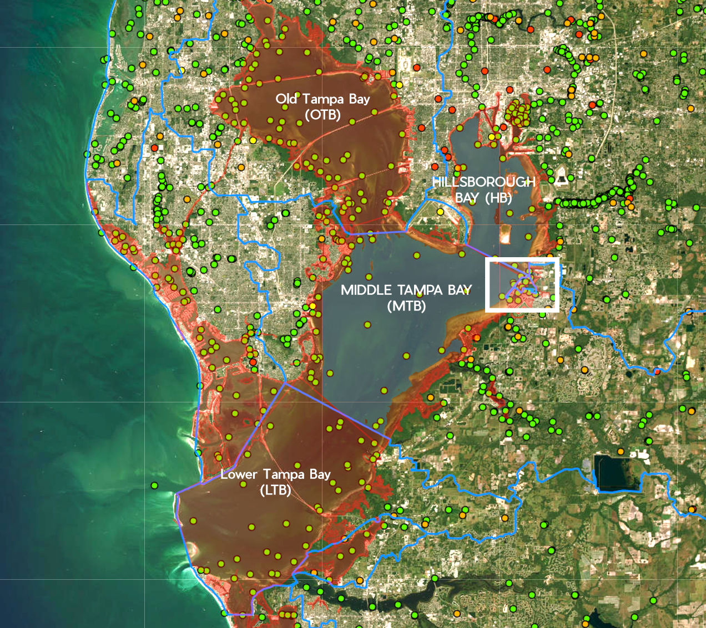

# Anthropogenic-Based Ecosystem Pressure Evaluation Index Metric: A Case Study of the Northern Tampa Bay Estuary

## Table of Contents

[Organization & Documentation](#docs)
- [Anthropogenic-Based Ecosystem Pressure Evaluation Index Metric: A Case Study of the Northern Tampa Bay Estuary](#anthropogenic-based-ecosystem-pressure-evaluation-index-metric-a-case-study-of-the-northern-tampa-bay-estuary)
  - [Table of Contents](#table-of-contents)
      - [Navigating the GitHub Repo](#navigating-the-github-repo)
  - [1. Introduction](#1-introduction)
  - [2. Project Description and objective](#2-project-description-and-objective)
  - [3. Current Status](#3-current-status)
  - [4. Progress History](#4-progress-history)
  - [5.Methodologies, EDA Results, Data Preparation for Final Model:](#methodologies-eda-results-data-preparation-for-final-model)
    - [API Design.](#api-design)
  - [6. Formation of the API](#6-formation-of-the-api)
  - [9. References](#9-references)
  - [10. Acknowledgements](#10-acknowledgements)
  - [11. License](#11-license)
  - [Previously recorded changes to the study:](#previously-recorded-changes-to-the-study)
#### Navigating the GitHub Repo
Jupyter Notebooks can be used to follow the order of the study.
This phase of the research has been consolidated into 3 notebooks and should be revieved in the following order:

1. 'EstuarineEcosystems_ProcEdaBLModel.ipynb'
2. 'AnthropogenicPressure_ProcEdaBLModel.ipynb'
3. 'A.P.Index_RNN.ipynb'
4. Data sources, a data dictionary and references are catalouged in '_Documentation.docx'
5. Stored scripts for library importing, data dictionary and functions are located in the notebooks folder.
6. Additional jupyter workbooks are stored in the repo. There is lost progress in the geospatial notebook, it was omitted from the study.

*General Note*: I recommend enabling scrolling for cell output in the notebook for easier reading.

## 1. Introduction
This project is associated with an ongoing effort to build a commercial dock in Apollo Beach, Florida, a coastal community located in 'Middle Tampa Bay'. Coastal construction of any kind significantly impacts the health of local ecosystems, introducing harmful chemicals, causing physical damage, and a range of other factors that disrupt the local ecosystem.

The construction of a new dock will inevitably damage local habitats, impacting species diversity and reducing the ecosystem's resilience. There are numerous unique characteristics of any ecosystem that are of significance, however this research focuses on 3 primary environments – open water, seafloor & human coastal communities. 

 

 
Figure1. 
> (A) Top L. marked sections of Tampa Bay  
> (B) Top R. Sampling Sites Near Proposed Construction site. prominent filled circles are active, all others are not inactive  
> (C) Bottom L. 2020 Population Density of Tampa Bay Region  
> (D) Bottom R. The massive scale of the watershed, the marked area is the HB watershed and the one directly underneath is MTB.  Marking in the >     center of the the image is the proposed study site 

 

Changes in the eastern coast of Tampa bay in the past 70 years. circles represent sampling stations used to collect data. Their strategic placement is better understood when looking at the original state of the habitat as opposed to its current, over-developed form.
 
[Context](#context)

[Research Review](#research-review)

The most common approach to estimate marine ecosystem health is, not too surprisingly, to examine past relationships of ecosystem health to which may then be substiated by human driven impacts.

The final models for consideration will evaluate 4 target index features. TBEP, a conservation research group, has been at the forefront of scientific research for the Tampa Bay ecosystem with multiple affiliations to national, academic and local government institutions.

TBEP (Tampa Bay Estuarine Program) has developed 2 novel indices to represent the health of (A) Benthic (seafloor) ecosystems (TBBI) and (B) the semi-pelagic or open water ecosystem (TBNI)
Both are described TBBI is an ecosystem-specific index formulated by the Tampa Bay Estuary Program to describe ecosystem health. This value is calculated by a series of transformations of environmental and biological values, including linear regression, linear discriminant analysis, and normalization. The description of this transformation can be found in the referenced literature at the end of this document.

The 3rd index is a calculated feature: the Shannon Diversity Index - a weighted measurement that balances species richness and abundance. 
- Species richness is the number of species in a given area
- Species abundance is the number of individuals within a given species or taxonomical grouping.

The 3rd index is a calculated feature: the Shannon Diversity Index - a weighted measurement that balances species richness and abundance.
- Species richness is the number of species in a given area
- Species abundance is the number of individuals within a given species or taxonomical grouping.

SDI is described by the following equation:
$$
H=\sum_{j=1}^{s} p_{i} ln(p_{i})
$$

The fourth and final feature is the new index that represents negative anthropogenic pressures on marine ecosystems. This will be done by using historic data to establish trends and relationships between 3 major soruces of damage to the local environment - chemical pollution, coastal development & population growth. Marine activity, such as vessel traffic, plays an important role but the scarcity of applicable data acquired makes proving statistically the relationship difficult. Better sources of data are required to analyze this aspect of human activity and weight it appropriately. 

## 2\. Project Description and objective 

The objective of this first phase of the study is to establish the formation of a novel index - one that describes the potential impact of human communities, activities and the negative pressure applied to marine ecosystem. Multiple indices exist for the Tampa Bay region and marine ecosystems at large. Regional indices were designed and have been rigorously tested by Tampa Bay Estaury Program (TBEP), the leading academic and governmental consortium designed to protect the bay. These indices, Tampa Bay Benthic Index (TBBI) and Tampa Bay Nekton Index (TBNI) describe the health of the Benthic and Pelagic environments of the bay. The Shannon Diversity Index (SDI) is a generalized and universally applicable index to categorize ecosystem health through species diversity and richness.

Multiple other indices exist, but these 3 indices are most useful in the context of this study given the available and type of data that is available publicly.

## 3\. Current Status

Data cleaning, exploratory data analysis, data pre-processing and baseline models have all been completed.
Neural net model has been completed and configured.
Positive preliminary results were achieved. The neural net performance should be further tested and rerun.

Compilation of the project and cleaning of the Git Repo and Jupyter notebooks is underway.

## 4\. Progress History

Baseline models to process and establish relationships between key features were required for both marine and man-made community ecosystems.
Proving a causal relationship between all indices meant that particular relationships were well defined - such as the distinction between inorganic and natural nitrogen.

Additionally, these models had to establish the relative importance of the features compiled to form the Anth. Pressure index.
This is the major outstanding task for the study and will require input from individuals with greater expertise in the field.
That meeting is set for 12/10/24

Additional models should be built as the study expands.

The studied had to pivot its current and primary objectives as the scope of the project grew, making delivery of the capstone project difficult within appropriate time restraints.

## 5\.Methodologies, EDA Results, Data Preparation for Final Model:

[Model Design](#model-design)
Linear models were initially the baseline model of choice. Transformation of data through standardization, normalization and taking log values were expected to produce indications if not define the relationship of base features in the data - such as the relationship between SDI, TBBI and TBNI with species diversity and richness, as well as other environmental parameters.

The original design of the study was to implement a SARIMAX time series analysis to establish patterns of seasonality, distinguished from as well as any non-congruent patterns that caused by external, non natural factors. It was not possible to do this for the marine ecosystem data as the experimental design and subsequent sampling frequency were not capable of producing data points at consistent intervals.

Nutrient loading were estimated in proxy by changes in concentrations of Nitrogen and Phosphorous compounds; however, it was shown during the EDA that Phosphates could not provide the resolution of data required and its patterns over time did not demonstrate or provide any infereneces on distinguishing between natural and anthropogenic sources. Instead, several nitrogen compounds were compared. Organic nitrogen was compared to inorganics forms over time in order to be able to establish a anthropogenic influence factor on their levels as was expected. Organic compounds are measured in distinct units - Kjeldahl - where as nitrates, nitrites and ammonia - inorganic nitrogen compounds - were expected to demonstrate anthropogenic influence. It is also well documented that Nitrogen has been one of the leading causes of ecosystem degradation in the bay, as related by a wealth of studies conducted by TBEP from the mid 1990s through the early 2010s.

### API Design.
 API is a basic mean sum model metric that uses weighted standardized values to approximate the relative impact of competing factors in a given system or model. In this study - it is the aggregate impact of human-derived sources of damage. One benefit to this approach is its ability to incorporate subsequent inclusion of other features as they are discovered or accurately assessed through the data without it disrupting the overall value of the index. It is described in the following simple equation:

Water quality sampling occurred regularly throughout the time period of interest in the study. Any irregularities in sampling patterns could be accounted for through imputation or estimated by other baseline models or parameters.

Population growth and property development were to be assessed with baseline linear models.

Establishments of weighted values for the API were to be established through a comparison of standardized values of the 3 anthropogenic features.

Finally, it was expected and demonstrated during the EDA phase that capturing the complex relationship between all features would be difficult. To this end, an LSTM Recurrent Neural Network model was chosen so that the data could be assessed as a time series. Proving a statistical relationship between existing marine ecosystem health indicators and this proposed novel index would permit this study to expand into its next phase, testing and vetting of weights for the API.

__[EDA, Pre-Processing](#processing-eda-findings)__

EDA was performed on each data set independently.

Marine ecosystems (bentdhic and pelagic) were cleaned and processd for modelling using standardization and feature reduction.

30 years of sampling data - including water quality conditions, species diversity and richness recorded through sampling and bycatch - were used to calculate Nekton/Benthic Shannon Diversity Index. Ultimately, 170 base features were used. TBNI and TBBI scores were provided by TBEP but were also calculated using the raw data.
-	Examination of the pelagic and benthic biodiversity index scores through traditional forms of correlation analysis proved difficult.
-	Correlation heatmaps did not demonstrate significant correlation between independent variables.
-	VIF analysis provided little evidence of multicollinearity, the exception to which was 2 species with low sample quantities.

__Anthropogenic Pressures__

Over 100 years worth of property development and construction data were acquired. This was reduced to the time period from 1990-2024 to match up with available biological data.
Nitrogen samples were used as proxies for fertilizer and other types of anthropogenic watershed pollution. After organic and inorganic nitrogen compounds were isolated, analysis of behavior over time using vector autoregression EDA and baseline established patterns of seasonality using Augmented Dickey-Fuller analysis.

Estimations of population growth and development rates were established through public and private records. 
Population growth was assessed using US census data and the data from the World Health Organization. While these provided few data points when aggregated at an annular level, the total sample size expanded comsoderably once the extent and influence of watershed pollution became apparent.

The geographic region of interest, once focused solely on waterfront front property. Coastal development when evaluated from an environmental science standpoint, however, understands coastal development beyond the waterfront and, specifically for Tampa Bay, the impact of population growth and development on the pollution of the watershed. 

Property development was estmiated through building permits and property records. Data permitted annual aggregation. Unlike population datasets which are well established but with a limited data set, the property record and building permit dataset were large.

Both population and developed were aggregated at the annual level before baseline model analysis.

Population growth, expected to be exponential as observed elsewhere in the world, was proven linear in this region despite rapid real estate development in more recent time.
Property development was less clear with construction patterns varying significantly. It is likely that geospatial distribution of construction plays a role in these irregular patterns.

__[Baseline Models](#baseline-models)__

Linear regression analysis of the ecosystem data, even with transformations, did not yield statistically significant results.  Further investigation using Variance Inflation Factor (VIF) and Principal Component Analysis (PCA) to understand the data's variance was inconclusive. PCA revealed that 100 out of 170 features explained less than 70% of the variance, suggesting high dimensionality and potentially complex relationships within the data.

Time Series Analysis (TSA) on the marine ecosystem data was not feasible due to limitations in sampling methodologies. Inconsistent sampling frequencies and separate sampling rates for benthic and pelagic habitats prevented accurate imputation of missing values, hindering the ability to capture stationarity or seasonality. However, water quality and nitrogen sampling data allowed for standardization of sample intervals, enabling TSA tests.

To analyze nitrogen compounds, stationarity was first established using Augmented Dickey-Fuller tests. Subsequently, Vector Autoregression (VAR) was employed to assess the relationships between organic and inorganic nitrogen compounds (ammonia, nitrates, and organic nitrogen) over time.  VAR analysis with varying lag periods revealed that organic nitrogen exhibited distinct patterns from ammonia and nitrates, while surprisingly, ammonia and nitrates showed no direct correlation. This finding, however, does not invalidate the hypothesis of anthropogenic sources for these compounds. Importantly, nitrogen concentrations displayed autocorrelation patterns at 4-week lag periods, aligning with potential anthropogenic influences like farming practices and sewage treatment. Based on these findings, organic nitrogen (measured in Kjeldahl) served as a proxy for natural nitrogen compounds, while nitrates and ammonia represented anthropogenic pressures.

## 6\. Formation of the API

Each system of data was compiled into one central Jupyter notebook 'API' that covers the formation of the API and application of the LSTM model to establish the relationship between API, SDI, TBBI and TBNI indices. The satisfactory performance of baseline models of satisfied requisite base criteria for establishing the preliminary API figures; however, deriving the specific relative weights of each anthropogenic feature was not as conclusive, despite normalizing values using a MinMax scaler. There was hesitance to further engineer any feature out of concern that excessive transformation could corrupt any observed relationships within results achieved before the final application of the neural net model. Consequently, 2 sets of weighted values were chosen based on literature review. These were:
1) 33% per compound
2) 50% weighted value of anthropogenic inorganic nitrogen compounds, to equal parts (25%) weighted values of population growth and development rates.

[Results of Anthropogenic Modelling and Conclusions](#results)

A LSTM RRN was the final model and the best way to find any relationships in biological data.

Preliminary design of this study designated the Shannon Diversity Index as the feature target of prediction; however, this was reevauluated after completion of EDA and baseline modelling. Since linear regression models were unable to capture the relationship between ecosystem features and SDI directly, a decision to use TBNI as the target feature was made. The choice was made because of the strength of the literature and the academic testing of the TBNI metric, specifically as it is region specific. Since SDI is a less region specific metric, it was used as a predictive feature in cobmination with standardized values of organic nitrogen to represent the natural ecosystem and an approximation of "natural" state measurements.

The LSTM produced encouraging results, with train, test and validation datasets demonstrating statastical significance of between TBNI scores, API scores and organic nitrogen. The specifics of the hyper parameters can be found in API jupyter notebook. In summary, 2 intermediate layers of nodes were were used and produced MSE of less than 3.5% This first round of RNN model evaluation provided encouraging results on the performance of the model, the objective of the study in its current phase and for future expansions of this metric, its applicatibility and performance for approximating the impact of human activity as a coastal community. Tampa and Florida both see high domestic immigration and there's no expectation that the risk of anthropogenic damage to coastal marine ecosystems will abate any time soon.

[Further considerations](#formation-of-a-new-index)

Time constraints in the completion of the project made it difficult to proceed past the establishment of a statistically significant relationship between the performance of marine ecosystem indicators and the API. Next iterations of the study should focus on refining the weight values of the model, whether they are dynamic or static, and possible causes of deviating behavior.

There are 2 additional anthropogenic factors that were ultimately omitted in the study that should be included. The first and most important is geospatial analysis. Tampa Bay is a highly complex ecosystem and factors that impact ecosystem health can vary significantly based on small changes in location. This includes harmful algal blooms and associated anoxic zones, changes in  water flow patterns, weather occurences and proximity to the freshwater sources that feed the bay. These changes become even more pronounced with overdevelopment and loss of natural habitat both on the coast and on land through land use changes, residential, commercial and industrial expansion.

A related, supplmentary analysis historic changes in land use through aerial in satellite imagery can inform our understanding of how changes in land use patterns, in addition to development, are impacting the bay. These analyses would only increase the resolution of our understanding of what factors play the biggest role in driving anthropogenic negative ecosystem pressures and would solidify the applicability of the API and help establish accurate weight values for the the index.

## 9\. References

## 10\. Acknowledgements

[Acknowledgements](#acknowledgements)

## 11\. License

## Previously recorded changes to the study:

<!-->
Design of the API first considered an adaptation of the Pascche Index - an economic metric to look at changes in valuation of goods over time. Difficulties in time series data precluded that possibility from this study. Subsequent studies can investigate its possible uses with better data sets.

Below are records of change to the study, as stated in previous iterations and reports:
- After Sprint 1, it became clear that the scope of my project as initially designed was beyond the scope of this course.
- The number of natural habitats were reduced from 4 to 2 with the emphasis now on the 2 fundamental environments that describe coastal ecosystem health: nekton/pelagic (free swimming) and benthic (seafloor).
- The original objective - the employment of ML and statistical models in the evaluation of successful environmental mitigation tools in coastal construction would take a large additional dataset along with a greater need of geospatial data and analysis. The project still matinains the objectigve of creating a final calculated feature, represented as the weighted aggregate of factors that exert influence.
- This proposed index has a lose conceptual tie to the HII index: the Human Influence Index, which describes human impact on terrestrial ecosystems.

Previously Recorded Findings:
- (incorrect statement) Multicollinearity is present in the data, as expected. Measurements, such as temperature at the top vs. the sea floor, can have relatively little variation.
- (No longer relevant after change in scope) This will be especially relevant when the data starts to account for sampling in overlapping environments, such as seagrass beds, which requires segmentation of those data.

### Description of Data(#data):

A description of the data sources and features can be found in a separate document in this repository folder titled "_Documentation.docx"

### References/Citations(#refs):
## Target Features: Indices and Supplementary Data of Interest

### Shannon-Weiner Diversity Index

A proxy measurement of overall ecosystem health and complexity.

Calculation of this index is calculated as:

Where H’ is the Species Diversity Index (SDI), s is the number of species, and pi is the proportion of individuals of each species belonging to the ith species of the total number of individuals.

### Tampa Bay Benthic Index (TBBI)

#####previously stated EDA Summary (in italics)

EDA has revealed some key aspects about the data:
  * Measurements for benthic habitat is problematic due to the sample design.
Interval between measurements is 2 years and only during the summer months.
This will make any time of time series analysis difficult;
however, if nekton and benthic sampling months are lined up, they are both follow the same overall structure and display the same type of seasonality within the data.
  * Species Richness should closely relate to SDI but the relationship isn’t that strong indicating that there is another factor impacting this relationship.
  * Species Richness and SDI have become weaker in recent years.
Richness has trended upwards while Diversity has decreased since 2015.

## Detailed Description of EDA Analysis

So far, a subset of benthic ecosystem data has been cleaned and used for a preliminary EDA.

This subset focuses on the geographic region surrounding the case study construction site.

The raw data describes sediment toxicology, standard practice sampling information (GPS, temperature, salinity, dates), and species collection.

As this dataset was explored, the need for a standardized measurement of ecosystem health became apparent.

Due to its wide applicability in any given environment, it was determined that the Shannon-Weiner Diversity Index (SDI) could potentially represent a normalized value.

This would allow for measurements and comparisons among ecosystems. Ultimately, with supplementary data, it can be used to create a composite, weighted index to represent the overall health of Tampa Bay.

Plotting the overall datasets demonstrates sampling in various habitats throughout the bay and nearby coastal systems.

The dataset is comprehensive and will be sufficient, in complement with other datasets, for the overall goals of this study.

In a healthy ecosystem, SDI is expected to have a close relationship with Species Richness.

It is surprising that the correlation between the two isn’t as strong over time as expected in the data.

This could be due to the distribution of sampling over time or indicate stress on the ecosystem from outside pressures.

In this case, species richness has trended upwards while diversity has returned to original levels from when data collection began.

## Future Work

  * Explore second model - SARIMAX, CCA and Passche Index Framework

  * Further tune Linear models to improve scoring

## Dependencies

  * List the specific software packages and libraries required to run -->